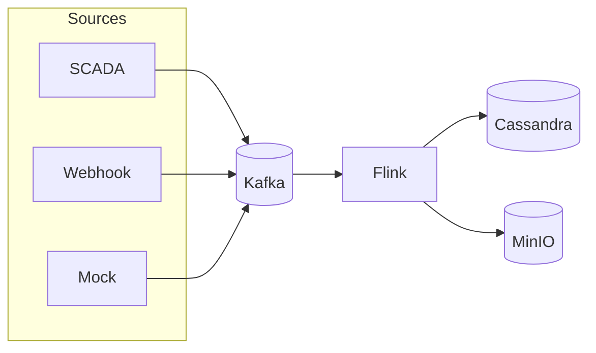
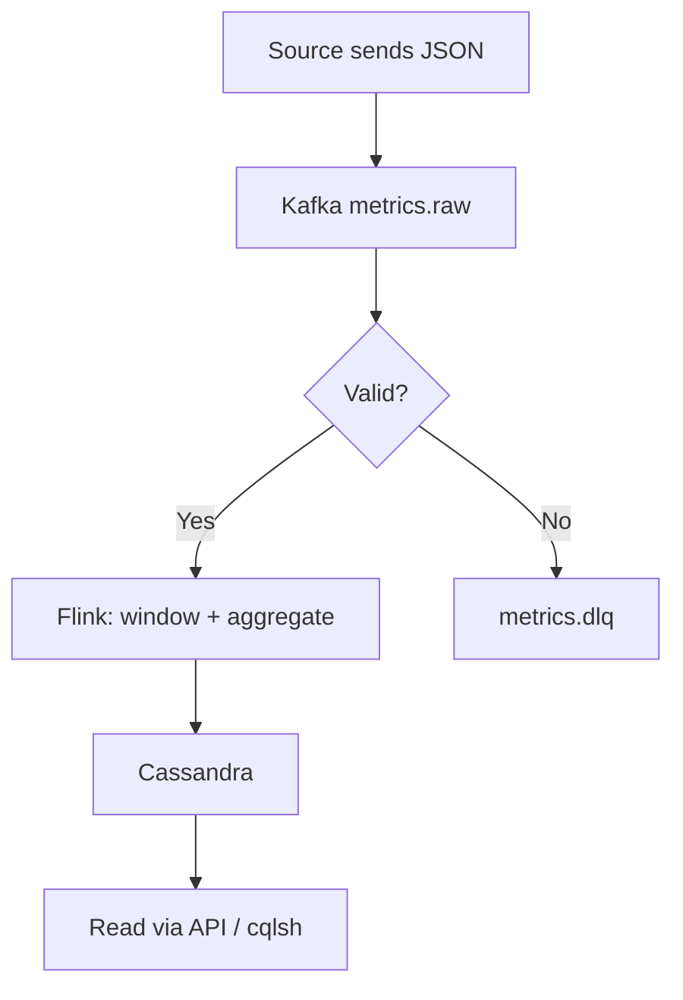

# RDG Stream Platform

Real-time stream processing pipeline inspired by Netflix RDG (Real-Time Distributed Graph).

> **Status: Documentation phase** — design docs are complete; implementation (Docker, code) starts at [Phase 2](./docs/tasks/phase-2-infrastructure.md).  
> **Documentation index:** [docs/README.md](./docs/README.md)

**100% free & open source** · runs locally in **Docker** · no paid cloud services.

[](https://github.com/anhthqb97/RDG-stream/actions/workflows/code-review.yml)

## Workflow overview



**Single event path:**



More charts: **[docs/workflow.md](./docs/workflow.md)** — build steps, test flow, recovery, Flink logic.

---

## What it does

Ingests metric events from plant equipment, buffers them in Kafka, processes them with Flink (validate, window, aggregate), and stores results in Cassandra for dashboards and APIs.

**Example event:**

```json
{
  "plant_id": "NM01",
  "equipment_id": "GEN-01",
  "metric": "power_output_mw",
  "value": 45.2,
  "unit": "MW",
  "ts": "2026-07-18T10:00:00Z"
}
```

---

## Stack

| Layer | Technology | Docker image |
|-------|------------|--------------|
| Ingestion | Apache Kafka 3.7 (KRaft) | `apache/kafka:3.7.0` |
| Processing | Apache Flink 1.19 (**PyFlink**) | `flink:1.19-scala_2.12-java11` |
| Storage | Apache Cassandra 4.1 | `cassandra:4.1` |
| Checkpoints | MinIO | `minio/minio:latest` |
| Dev UI | Kafbat Kafka UI | `kafbat/kafka-ui:latest` |
| Producers / API | **Python** services | custom Docker build |

---

## Prerequisites

- [Docker Desktop](https://www.docker.com/products/docker-desktop/) or Docker Engine + Compose v2
- **8 GB+ RAM** allocated to Docker (12 GB recommended)
- Free ports: `8090`, `8081`, `9042`, `9092`, `9000`, `9001`

---

## Quick start (after implementation)

> **Not available yet.** The commands below apply once Phase 2–6 are implemented. See [docs/tasks/phase-2-infrastructure.md](./docs/tasks/phase-2-infrastructure.md).

```bash
git clone <repo-url> && cd rdg-stream

# Start full dev stack (requires docker-compose.yml)
docker compose --profile dev up -d

# Wait ~60s, then check health
docker compose ps

# Open UIs
open http://localhost:8090   # Kafka UI
open http://localhost:8081   # Flink Dashboard
open http://localhost:9001   # MinIO Console (minioadmin / minioadmin)

# Verify data (after Flink job is running)
docker compose logs mock-producer --tail 10
docker compose exec cassandra cqlsh -e "SELECT * FROM rdg.metrics_current LIMIT 5;"

# Stop
docker compose --profile dev down

# Reset all data
docker compose --profile dev down -v
```

---

## Documentation quick start (current phase)

1. Read [docs/README.md](./docs/README.md) — documentation index
2. Review [docs/pipeline.md](./docs/pipeline.md) — components and data flow
3. Review [docs/workflow.md](./docs/workflow.md) — workflow charts
4. When ready to implement → [docs/tasks/phase-2-infrastructure.md](./docs/tasks/phase-2-infrastructure.md)

---

## Local URLs

| Service | URL |
|---------|-----|
| Kafka | `localhost:9092` |
| Kafka UI | http://localhost:8090 |
| Flink Dashboard | http://localhost:8081 |
| Cassandra | `localhost:9042` |
| MinIO API | http://localhost:9000 |
| MinIO Console | http://localhost:9001 |

---

## Documentation

All docs are written in **English only**. Start at **[docs/README.md](./docs/README.md)**.

| Doc | Description |
|-----|-------------|
| [docs/README.md](./docs/README.md) | **Documentation index** — start here, status, reading order |
| [docs/tasks.md](./docs/tasks.md) | Task list index — links to each phase file |
| [docs/tasks/](./docs/tasks/) | Phase tasks — requirements + TASK-001 – TASK-065 |
| [docs/open-questions.md](./docs/open-questions.md) | Unresolved decisions (TASK-010) |
| [docs/workflow.md](./docs/workflow.md) | **Workflow charts** — data flow, build, test, recovery |
| [docs/pipeline.md](./docs/pipeline.md) | **Pipeline reference** — diagram, component IDs, connections |
| [docs/architecture.md](./docs/architecture.md) | Architecture, schema, Docker services, profiles |
| [docs/implementation-checklist.md](./docs/implementation-checklist.md) | Step-by-step build checklist |
| [docs/test-plan.md](./docs/test-plan.md) | Test plan with 24 test cases (TC-001 – TC-024) |

---

## Project structure

**Current (documentation phase):**

```
rdg-stream/
├── README.md
└── docs/
    ├── README.md                 ← documentation index
    ├── pipeline.md
    ├── architecture.md
    ├── workflow.md
    ├── open-questions.md
    ├── implementation-checklist.md
    ├── test-plan.md
    ├── tasks.md
    └── tasks/
        ├── README.md
        ├── requirements.md
        └── phase-0-setup.md … phase-10-production.md
```

**Planned (implementation phase — not created yet):**

```
rdg-stream/
├── docker-compose.yml            ← Phase 2
├── kafka/init-topics.sh          ← Phase 3
├── cassandra/schema.cql          ← Phase 5
├── flink/jobs/                   ← Phase 4 (PyFlink / Python)
│   ├── rdg_job.py
│   └── requirements.txt
└── producers/mock/               ← Phase 6 (Python)
```

**Language:** **Python** for Flink job (PyFlink), mock producer, webhook, and API ([open-questions.md](./docs/open-questions.md))

---

## Kafka topics

| Topic | Purpose |
|-------|---------|
| `metrics.raw` | Incoming metric events |
| `metrics.dlq` | Invalid / failed records |
| `events.lifecycle` | Optional downstream events |

---

## Compose profiles

| Profile | Services |
|---------|----------|
| `default` | Kafka, Flink, Cassandra, MinIO, init |
| `dev` | default + Kafka UI + mock producer |

---

## Smoke test

Minimum validation after setup — see [test-plan.md](./docs/test-plan.md) for full details:

1. **TC-001** — Stack starts healthy
2. **TC-007** — Mock producer sends events
3. **TC-008** — Flink job RUNNING
4. **TC-016** — End-to-end: Kafka → Flink → Cassandra
5. **TC-013** — Rows in `rdg.metrics_current`

---

## CI / code review

GitHub Actions runs on every **pull request** and **push to main**:

| Check | When |
|-------|------|
| Commit message format | PR only (`TASK-XXX: <action> <message>`) |
| Python lint (ruff) | When `flink/` or `producers/` change |
| YAML lint | When Docker or workflow files change |
| Docker Compose validate | When `docker-compose.yml` exists |
| Secret scan (gitleaks) | Always |
| PR summary comment | PR only |

Workflow: [`.github/workflows/code-review.yml`](.github/workflows/code-review.yml)

---

## License

Apache 2.0 stack components (Kafka, Flink, Cassandra). MinIO is AGPL 3.0. See individual project licenses.
