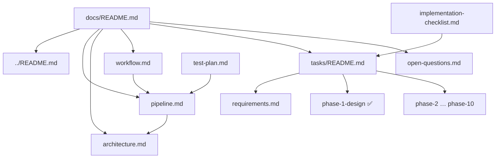

# Documentation — RDG Stream Platform

> **Start here.** Phases 0–2 are complete — the Docker stack runs locally. Next: PyFlink job and mock producer.

---

## Project status

| Area | Status | Notes |
|------|--------|-------|
| **Documentation** | Complete | Phase 1 (design) complete |
| **Environment** | Complete | Phase 0 — Docker, ports, repo verified |
| **Infrastructure** | Complete | Phase 2 — `docker compose --profile dev up -d` |
| **Kafka / Cassandra** | Complete | Phase 3 + 5 — topics and schema verified |
| **Pipeline code** | Not started | Phases 4, 6, 9 pending |

**Complete:** Phase 0 — Environment · Phase 1 — Design · Phase 2 — Infrastructure · Phase 3 — Kafka · Phase 5 — Cassandra  
**Next step:** [Phase 4 — Flink](./tasks/phase-4-flink.md) (PyFlink job)

---

## How to read these docs

| If you want to… | Read this |
|-----------------|-----------|
| Understand the big picture | [../README.md](../README.md) |
| See components and connections | [pipeline.md](./pipeline.md) |
| See workflow charts | [workflow.md](./workflow.md) |
| Read architecture details | [architecture.md](./architecture.md) |
| Track requirements | [tasks/requirements.md](./tasks/requirements.md) |
| Work through build tasks | [tasks/README.md](./tasks/README.md) → phase files |
| Quick checklist while building | [implementation-checklist.md](./implementation-checklist.md) |
| Run tests (after implementation) | [test-plan.md](./test-plan.md) · [use-cases.md](./use-cases.md) |
| See unresolved decisions | [open-questions.md](./open-questions.md) |

---

## Document roles (avoid duplication)

| Document | Purpose | Audience |
|----------|---------|----------|
| **pipeline.md** | Single reference: diagram, IDs, schema, URLs | Everyone |
| **architecture.md** | Technical design: stack, CQL, Docker services | Developers |
| **workflow.md** | Visual flows: data path, build, test, recovery | New team members |
| **tasks/** | Detailed tasks per phase (TASK-001+) | Implementers |
| **implementation-checklist.md** | Condensed checklist with commands | During build/debug |
| **test-plan.md** | Test cases TC-001 – TC-024 | QA / validation |
| **use-cases.md** | Business use cases UC-01 – UC-07 | Product / QA |
| **open-questions.md** | Decisions deferred to implementation | Tech lead |

**Rule:** Design details live in `pipeline.md` and `architecture.md`. Tasks live in `tasks/`. The checklist links to both — it does not duplicate full specs.

---

## Recommended reading order

### 1. Learn the system (documentation only)

```
README.md → pipeline.md → workflow.md → architecture.md
```

### 2. Plan implementation

```
tasks/requirements.md → tasks/README.md → tasks/phase-2-infrastructure.md
```

### 3. Validate (after code exists)

```
test-plan.md → tasks/phase-9-validation.md
```

---

## Documentation map



---

## File index

### Root

| File | Description |
|------|-------------|
| [README.md](../README.md) | Project overview |

### docs/

| File | Description |
|------|-------------|
| [pipeline.md](./pipeline.md) | Pipeline reference |
| [architecture.md](./architecture.md) | Architecture & schema |
| [workflow.md](./workflow.md) | Workflow charts |
| [implementation-checklist.md](./implementation-checklist.md) | Build checklist |
| [test-plan.md](./test-plan.md) | Test cases |
| [tasks.md](./tasks.md) | Task index |
| [open-questions.md](./open-questions.md) | Open decisions |

### docs/tasks/

| File | Phase | Status |
|------|-------|--------|
| [requirements.md](./tasks/requirements.md) | Requirements | Complete |
| [phase-0-setup.md](./tasks/phase-0-setup.md) | Environment | **Complete** |
| [phase-1-design.md](./tasks/phase-1-design.md) | Design | **Complete** |
| [phase-2-infrastructure.md](./tasks/phase-2-infrastructure.md) | Docker | **Complete** |
| [phase-3-kafka.md](./tasks/phase-3-kafka.md) | Kafka | **Complete** |
| [phase-4-flink.md](./tasks/phase-4-flink.md) | Flink | Not started |
| [phase-5-cassandra.md](./tasks/phase-5-cassandra.md) | Cassandra | **Complete** |
| [phase-6-sources.md](./tasks/phase-6-sources.md) | Sources | Not started |
| [phase-7-downstream.md](./tasks/phase-7-downstream.md) | Downstream | Not started |
| [phase-8-observability.md](./tasks/phase-8-observability.md) | Observability | Not started |
| [phase-9-validation.md](./tasks/phase-9-validation.md) | Validation | Not started |
| [phase-10-production.md](./tasks/phase-10-production.md) | Production | Not started |

---

## Planned repo layout (implementation phase)

These folders are **documented but not created yet**:

```
rdg-stream/
├── docker-compose.yml      ← Phase 2
├── kafka/init-topics.sh    ← Phase 3
├── cassandra/schema.cql    ← Phase 5
├── flink/jobs/             ← Phase 4
└── producers/mock/         ← Phase 6
```

---

## Documentation changelog

| Date | Change |
|------|--------|
| 2026-07-18 | Initial documentation set: pipeline, architecture, workflow, tasks, test plan |
| 2026-07-18 | All open questions resolved; **Python (PyFlink)** for Flink job and all app services |