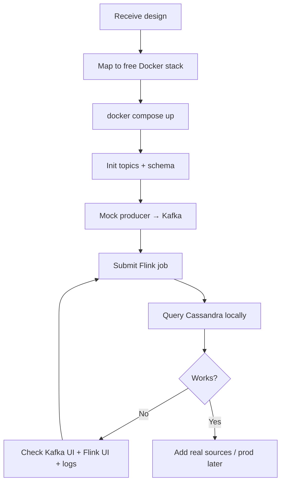

# Implementation Checklist — RDG Stream Platform

> **Condensed build checklist** — use while implementing. For detailed task specs, see [tasks/](./tasks/) (one file per phase).
>
> **Status:** Phases 0–3 and 5 complete. Next: **Phase 4** (PyFlink job).
>
> **100% free & open source** · **Docker Compose** · **Test on your laptop**
>
> Companion: [docs/README.md](./README.md) · [tasks/README.md](./tasks/README.md) · [pipeline.md](./pipeline.md) · [workflow.md](./workflow.md) · [architecture.md](./architecture.md) · [test-plan.md](./test-plan.md)

---

## How this doc relates to tasks/

| Document | Use when |
|----------|----------|
| **tasks/phase-N.md** | Detailed specs, deliverables, verify steps per phase |
| **This checklist** | Quick reference and commands during build/debug |
| **test-plan.md** | Validation after implementation |

Do not duplicate design details here — see [pipeline.md](./pipeline.md) and [architecture.md](./architecture.md).

## Free stack (no paid services)

| Layer | Tool | License | Docker image |
|-------|------|---------|--------------|
| Ingestion | Apache Kafka (KRaft) | Apache 2.0 | `apache/kafka:3.7.0` |
| Processing | Apache Flink | Apache 2.0 | `flink:1.19-scala_2.12-java11` |
| Storage | Apache Cassandra | Apache 2.0 | `cassandra:4.1` |
| Kafka UI | Kafbat UI | Apache 2.0 | `kafbat/kafka-ui:latest` |
| Checkpoint store | MinIO (S3-compatible) | AGPL 3.0 | `minio/minio:latest` |
| Mock producer | Python script | — | custom `Dockerfile` |
| Query tool | `cqlsh` (in Cassandra image) | Apache 2.0 | built-in |

**Cost:** $0 — only Docker Desktop (free for personal use) and your machine RAM (~8 GB minimum, 12 GB recommended).

---

## Prerequisites (local)

- [ ] **Docker Desktop** or **Docker Engine + Compose v2** installed
- [ ] **8 GB+ RAM** allocated to Docker (Settings → Resources)
- [ ] **Ports free:** `8090`, `8081`, `9042`, `9092`, `9000`, `9001`
- [ ] Clone repo: `git clone … && cd rdg-stream`

---

## Quick start — test locally

```bash
# 1. Start full dev stack (Kafka + Flink + Cassandra + UI + mock producer)
docker compose --profile dev up -d

# 2. Wait ~60s for Cassandra + Kafka to be healthy
docker compose ps

# 3. Open UIs in browser
open http://localhost:8090    # Kafka UI — see topics & messages
open http://localhost:8081      # Flink Dashboard — submit & monitor jobs

# 4. Verify Kafka has messages (mock producer)
docker compose logs mock-producer --tail 20

# 5. Query Cassandra (after Flink job writes data)
docker compose exec cassandra cqlsh -e "SELECT * FROM rdg.metrics_current LIMIT 10;"

# 6. Stop everything
docker compose --profile dev down
```

**Reset data (fresh start):**

```bash
docker compose --profile dev down -v   # removes volumes
docker compose --profile dev up -d
```

---

## Pipeline target

```
Mock producer / webhook / SCADA
        ↓
   Apache Kafka          ← free, Docker
        ↓
   Apache Flink           ← free, Docker
        ↓
   Apache Cassandra       ← free, Docker
        ↓
   cqlsh / read API       ← verify locally
```

---

## Phase 1 — Understand the design

> **Status: Complete** — see [tasks/phase-1-design.md](./tasks/phase-1-design.md)

- [x] **1.1 Identify layers** — sources → ingestion → processing → storage
- [x] **1.2 List data flows** — producer → topic → Flink → table
- [x] **1.3 Confirm free stack** — no Confluent Cloud, no AWS MSK, no paid DB
- [x] **1.4 Define contracts** — JSON schema, topic names, CQL tables
- [x] **1.5 Local-only scope** — single broker, single Cassandra node, 1 TaskManager
- [x] **1.6 Open questions** — [open-questions.md](./open-questions.md)

---

## Phase 2 — Docker infrastructure (local)

> **Detailed tasks:** [tasks/phase-2-infrastructure.md](./tasks/phase-2-infrastructure.md)

- [x] **2.1 `docker-compose.yml`** — all services defined
- [x] **2.2 Networks** — `stream` (Kafka, Flink) + `storage` (Cassandra)
- [x] **2.3 Volumes** — persist Kafka + Cassandra data between restarts
- [x] **2.4 Init container** — create Kafka topics + Cassandra keyspace on first boot
- [x] **2.5 Healthchecks** — `depends_on: condition: service_healthy`
- [x] **2.6 Profiles** — `default` (core) · `dev` (+ UI, mock producer)

**Repo layout:**

```
rdg-stream/
├── docker-compose.yml
├── kafka/init-topics.sh
├── cassandra/schema.cql
├── flink/jobs/
├── producers/mock/
└── docs/
```

**Bring up core only (no UI):**

```bash
docker compose up -d
```

**Bring up dev (recommended for learning):**

```bash
docker compose --profile dev up -d
```

---

## Phase 3 — Ingestion (Kafka)

> **Detailed tasks:** [tasks/phase-3-kafka.md](./tasks/phase-3-kafka.md)

- [x] **3.1 Topics** — `metrics.raw`, `metrics.dlq`, `events.lifecycle`
- [x] **3.2 Partitions** — 3 locally (6 in prod)
- [ ] **3.3 JSON schema** — see below
- [ ] **3.4 Mock producer** — Python container publishes every 2s
- [ ] **3.5 Verify in Kafka UI** — http://localhost:8090 → Topics → `metrics.raw`

**Local test — produce one message manually:**

```bash
docker compose exec kafka /opt/kafka/bin/kafka-console-producer.sh \
  --bootstrap-server localhost:9092 \
  --topic metrics.raw
# paste JSON, Ctrl+D
```

**Schema (`metrics.raw`):**

```json
{
  "plant_id": "NM01",
  "equipment_id": "GEN-01",
  "metric": "power_output_mw",
  "value": 45.2,
  "unit": "MW",
  "ts": "2026-07-18T10:00:00Z"
}
```

---

## Phase 4 — Processing (Flink)

> **Detailed tasks:** [tasks/phase-4-flink.md](./tasks/phase-4-flink.md)

- [ ] **4.1 Kafka source** — read `metrics.raw`
- [ ] **4.2 Validate → DLQ** — bad JSON to `metrics.dlq`
- [ ] **4.3 KeyBy + window** — `plant_id` + `metric`, 1 min tumbling
- [ ] **4.4 Aggregate** — avg, min, max
- [ ] **4.5 Cassandra sink** — write to `metrics_current` + `metrics_ts`
- [ ] **4.6 Checkpoints** — local disk or MinIO (`http://localhost:9000`)
- [ ] **4.7 Submit job locally:**

```bash
# Option A: PyFlink CLI
docker compose exec flink-jobmanager flink run -py /opt/flink/jobs/rdg_job.py

# Option B: Flink Dashboard UI
```

- [ ] **4.8 Verify in Flink UI** — http://localhost:8081 → Running Jobs

---

## Phase 5 — Storage (Cassandra)

> **Detailed tasks:** [tasks/phase-5-cassandra.md](./tasks/phase-5-cassandra.md)

- [x] **5.1 Apply schema** — `cassandra/schema.cql` via init script
- [x] **5.2 Tables** — `rdg.metrics_current`, `rdg.metrics_ts`
- [ ] **5.3 Local query test:**

```bash
docker compose exec cassandra cqlsh -e "DESCRIBE KEYSPACE rdg;"
docker compose exec cassandra cqlsh -e "SELECT * FROM rdg.metrics_current;"
docker compose exec cassandra cqlsh -e "SELECT * FROM rdg.metrics_ts LIMIT 5;"
```

- [ ] **5.4 Confirm Flink wrote rows** — after job runs 1+ minute

---

## Phase 6 — Data sources (local substitutes)

> **Detailed tasks:** [tasks/phase-6-sources.md](./tasks/phase-6-sources.md)

| Real source | Local free substitute |
|-------------|----------------------|
| SCADA / Historian | Mock producer (random metrics) |
| REST webhook | `curl` POST to a small Python/Node adapter → Kafka |
| Mobile / IoT | JSON file replay via `kafka-console-producer` |

- [ ] **6.1 Mock producer running** — `docker compose logs -f mock-producer`
- [ ] **6.2 Webhook adapter** — optional small container on port `8080`
- [ ] **6.3 Replay file** — `kafka-console-producer` with `--property parse.key=true`

---

## Phase 7 — Downstream (optional, local)

> **Detailed tasks:** [tasks/phase-7-downstream.md](./tasks/phase-7-downstream.md)

- [x] **7.1 Read via cqlsh** — enough for pipeline proof
- [x] **7.2 Simple read API** — Python FastAPI (free, Docker)
- [x] **7.3 External app** — connect to `localhost:9042` from host via read API

---

## Phase 8 — Observability (free, local)

> **Detailed tasks:** [tasks/phase-8-observability.md](./tasks/phase-8-observability.md)

| Tool | URL | What to check |
|------|-----|---------------|
| Kafka UI | http://localhost:8090 | Topics, lag, messages |
| Flink Dashboard | http://localhost:8081 | Job status, backpressure |
| MinIO Console | http://localhost:9001 | Checkpoint files |
| Docker logs | `docker compose logs -f <service>` | Errors, startup |

- [x] **8.1 Kafka lag** — consumer group behind producer
- [x] **8.2 Flink metrics** — records in/out per second
- [x] **8.3 DLQ monitor** — messages in `metrics.dlq` = schema bugs

---

## Phase 9 — Production (later — still free options)

> **Detailed tasks:** [tasks/phase-10-production.md](./tasks/phase-10-production.md)

Local dev skips security. For self-hosted prod (still $0 software):

- [ ] **9.1 Kafka** — multi-broker KRaft or Strimzi on k3s (free)
- [ ] **9.2 Cassandra** — 3-node cluster
- [ ] **9.3 MinIO** — distributed mode for checkpoints
- [ ] **9.4 TLS + auth** — optional for internal networks
- [ ] **9.5 CI** — GitHub Actions (free tier) to lint/test PyFlink job

---

## Phase 10 — Local validation (definition of done)

> **Detailed tasks:** [tasks/phase-9-validation.md](./tasks/phase-9-validation.md) · Test cases: [test-plan.md](./test-plan.md)

- [ ] **10.1 Stack starts** — `docker compose --profile dev up -d` → all healthy
- [ ] **10.2 Messages in Kafka** — visible in Kafka UI
- [ ] **10.3 Flink job running** — green in Dashboard
- [ ] **10.4 Rows in Cassandra** — `SELECT` returns data
- [ ] **10.5 DLQ empty** — no bad schema in mock data
- [ ] **10.6 Restart test** — `docker compose restart flink-taskmanager` → job recovers
- [ ] **10.7 Clean teardown** — `docker compose down -v` works

---

## Recommended build order (local first)

| Order | Task | How to verify |
|-------|------|---------------|
| 1 | `docker compose --profile dev up -d` | `docker compose ps` all healthy |
| 2 | Cassandra schema applied | `cqlsh -e "DESCRIBE rdg;"` |
| 3 | Kafka topics exist | Kafka UI → Topics |
| 4 | Mock producer | logs show JSON events |
| 5 | Flink job submitted | Dashboard → Running |
| 6 | Cassandra has data | `SELECT * FROM rdg.metrics_current` |
| 7 | Break & fix test | restart Flink, data keeps flowing |

---

## Docker services (local)

| Service | Image | Host port | Network |
|---------|-------|-----------|---------|
| kafka | `apache/kafka:3.7.0` | 9092 | stream |
| kafka-ui | `kafbat/kafka-ui:latest` | 8090 | stream |
| flink-jobmanager | `flink:1.19-scala_2.12-java11` | 8081 | stream |
| flink-taskmanager | `flink:1.19-scala_2.12-java11` | — | stream |
| cassandra | `cassandra:4.1` | 9042 | storage |
| minio | `minio/minio:latest` | 9000, 9001 | stream |
| init | `apache/kafka:3.7.0` | — | stream |
| mock-producer | custom build | — | stream |

**Profiles:**

| Profile | Services |
|---------|----------|
| `default` | kafka, cassandra, flink, minio, init |
| `dev` | default + kafka-ui + mock-producer |

**Resource tip:** If Cassandra OOMs, set `MAX_HEAP_SIZE=512M` and `HEAP_NEWSIZE=128M` in compose env.

---

## Workflow diagram

