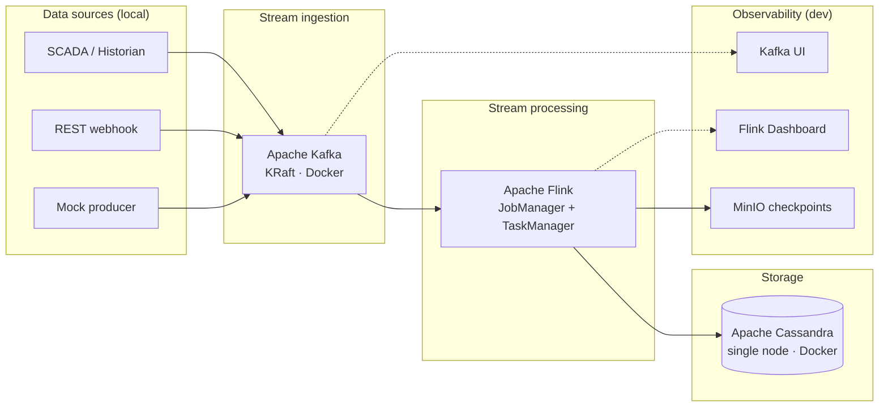

# Pipeline — RDG Stream Platform

> **Single reference** for all components, connections, and data flow.  
> Index: [README.md](./README.md) · Details: [architecture.md](./architecture.md) · Charts: [workflow.md](./workflow.md) · Tasks: [tasks/](./tasks/) · Tests: [test-plan.md](./test-plan.md)

---

## Diagram



**Legend:** solid line = data flow · dotted line = monitor / debug only

---

## Component registry

| ID | Name | Layer | Docker service | Host port | Network |
|----|------|-------|----------------|-----------|---------|
| **S1** | SCADA / Historian | Source | — (external) | — | — |
| **S2** | REST webhook | Source | — (external) | — | — |
| **S3** | Mock producer | Source | `mock-producer` | — | stream |
| **KF** | Apache Kafka | Ingestion | `kafka` | 9092 | stream |
| **FL** | Apache Flink | Processing | `flink-jobmanager`, `flink-taskmanager` | 8081 | stream |
| **CS** | Apache Cassandra | Storage | `cassandra` | 9042 | storage |
| **MO** | MinIO | Checkpoint | `minio` | 9000, 9001 | stream |
| **KUI** | Kafka UI | Observability | `kafka-ui` | 8090 | stream |
| **FUI** | Flink Dashboard | Observability | (built into FL) | 8081 | stream |

---

## Connections

| From | To | Type | Protocol / detail |
|------|-----|------|-------------------|
| S1 | KF | produce | → topic `metrics.raw` |
| S2 | KF | produce | → topic `metrics.raw` |
| S3 | KF | produce | → topic `metrics.raw` |
| KF | FL | consume | Flink reads `metrics.raw` |
| FL | CS | sink | writes `rdg.metrics_current`, `rdg.metrics_ts` |
| FL | MO | checkpoint | `s3://flink-checkpoints/` |
| FL | KF | produce | invalid records → `metrics.dlq` |
| FL | KF | produce | optional → `events.lifecycle` |
| KF | KUI | monitor | browse topics & messages |
| FL | FUI | monitor | job status, metrics, backpressure |

---

## Data flow (step by step)

```
S1 ──┐
S2 ──┼──► KF (metrics.raw) ──► FL (validate, window, aggregate) ──► CS (Cassandra)
S3 ──┘         │                         │                              │
               │                         ├──► MO (checkpoints)          │
               └──► KUI (debug)           └──► FUI (debug)               │
                                                                          ▼
                                                                    read via cqlsh / API
```

| Step | Component | Action |
|------|-----------|--------|
| 1 | S1 / S2 / S3 | Emit JSON metric events |
| 2 | KF | Buffer in `metrics.raw` |
| 3 | FL | Consume, validate, KeyBy, 1-min window |
| 4 | FL | Invalid → `metrics.dlq` |
| 5 | FL | Aggregate (avg, min, max) |
| 6 | CS | Persist snapshot + time-series |
| 7 | MO | Save Flink state for recovery |
| 8 | KUI / FUI | Dev-only inspection |

---

## Kafka topics

| Topic | Producer | Consumer |
|-------|----------|----------|
| `metrics.raw` | S1, S2, S3 | FL |
| `metrics.dlq` | FL | manual replay |
| `events.lifecycle` | FL | optional downstream |

---

## Message schema (`metrics.raw`)

```json
{
  "plant_id": "NM01",
  "equipment_id": "GEN-01",
  "metric": "power_output_mw",
  "value": 45.2,
  "unit": "MW",
  "ts": "2026-07-18T10:00:00Z"
}
```

---

## Cassandra tables (CS)

| Table | Purpose |
|-------|---------|
| `rdg.metrics_current` | Latest value per plant + metric |
| `rdg.metrics_ts` | Historical time-series by day bucket |

---

## Docker images

| ID | Image |
|----|-------|
| KF | `apache/kafka:3.7.0` |
| FL | `flink:1.19-scala_2.12-java11` |
| CS | `cassandra:4.1` |
| MO | `minio/minio:latest` |
| KUI | `kafbat/kafka-ui:latest` |
| S3 | custom (Python mock) |

---

## Local URLs

| ID | URL |
|----|-----|
| KF | `localhost:9092` |
| FL / FUI | http://localhost:8081 |
| CS | `localhost:9042` |
| MO | http://localhost:9001 (console) |
| KUI | http://localhost:8090 |

---

## Compose profiles

| Profile | Components running |
|---------|-------------------|
| `default` | KF, FL, CS, MO, init |
| `dev` | default + S3, KUI |

```bash
docker compose --profile dev up -d
```
