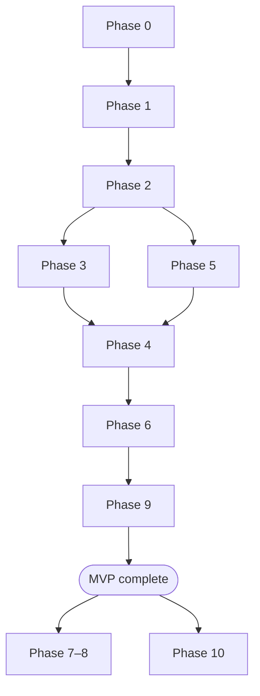

# Tasks — RDG Stream Platform

> One file per phase. Requirements: [requirements.md](./requirements.md)  
> **Project status:** Phase 9 validation complete (MVP + P1 tests). See [../README.md](../README.md).

---

## Phase index

| Phase | File | Tasks | Priority | Status |
|-------|------|-------|----------|--------|
| 0 | [phase-0-setup.md](./phase-0-setup.md) | TASK-001 – 004 | P0 | **Complete** |
| 1 | [phase-1-design.md](./phase-1-design.md) | TASK-005 – 010 | P0 | **Complete** |
| 2 | [phase-2-infrastructure.md](./phase-2-infrastructure.md) | TASK-011 – 020 | P0 | **Complete** |
| 3 | [phase-3-kafka.md](./phase-3-kafka.md) | TASK-021 – 026 | P0 | **Complete** |
| 4 | [phase-4-flink.md](./phase-4-flink.md) | TASK-027 – 036 | P0 | **Complete** |
| 5 | [phase-5-cassandra.md](./phase-5-cassandra.md) | TASK-037 – 041 | P0 | **Complete** |
| 6 | [phase-6-sources.md](./phase-6-sources.md) | TASK-042 – 045 | P1 | **Complete** (042–043) |
| 7 | [phase-7-downstream.md](./phase-7-downstream.md) | TASK-046 – 048 | P2 | Not started |
| 8 | [phase-8-observability.md](./phase-8-observability.md) | TASK-049 – 052 | P1 | Not started |
| 9 | [phase-9-validation.md](./phase-9-validation.md) | TASK-053 – 059 | P0 | **Complete** |
| 10 | [phase-10-production.md](./phase-10-production.md) | TASK-060 – 065 | P3 | Not started |

**MVP:** Phase 0 → 2 → 3 + 5 → 4 → 6 → 9

**Commits:** One separate commit per task (`TASK-XXX:`). Push after each task — see [.cursor/rules/rdg-stream.mdc](../../.cursor/rules/rdg-stream.mdc).

---

## Execution order

---

## Sprints

| Sprint | Phases | Goal |
|--------|--------|------|
| **Sprint 1** | 0, 1, 2, 3, 4, 5, 6, 9 (partial) | MVP pipeline running locally |
| **Sprint 2** | 8, 9 (full), 6 (optional) | Observability + full test plan |
| **Sprint 3** | 7, 10 | Read API + production hardening |

---

## Definition of done (MVP)

- [x] Phases 0–6 and 9 (TASK-053 – 059) complete
- [ ] `docker compose --profile dev up -d` starts without errors
- [ ] Mock producer → Kafka → Flink → Cassandra works
- [x] Smoke tests TC-001, TC-007, TC-008, TC-016, TC-013 pass

---

## Progress tracker

| Date | Sprint | Phases done | Blockers | Notes |
|------|--------|-------------|----------|-------|
| 2026-07-18 | Documentation | Phase 1 | — | Design docs complete |
| 2026-07-18 | Sprint 1 (impl) | Phase 0 | — | Docker, ports, repo verified |
| 2026-07-18 | Sprint 1 (impl) | Phase 2 | — | docker-compose.yml, all services healthy |
| 2026-07-18 | Sprint 1 (impl) | Phase 3, 5 | — | Topics + schema verified (TC-002–005) |
| | Sprint 1 (impl) | 4 / 8 | — | Next: Phase 4 (PyFlink) |
| | Sprint 2 | / 2 | | |
| | Sprint 3 | / 2 | | |

**Priority:** P0 = must have · P1 = should have · P2 = nice to have · P3 = future

---

## Related docs

- [architecture.md](../architecture.md)
- [implementation-checklist.md](../implementation-checklist.md)
- [test-plan.md](../test-plan.md)
- [workflow.md](../workflow.md)