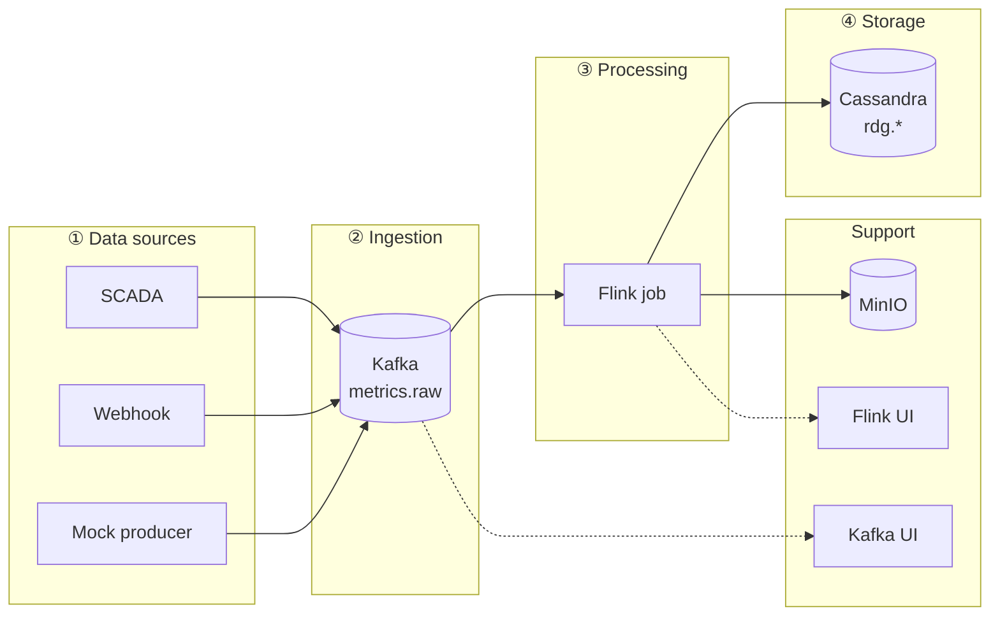
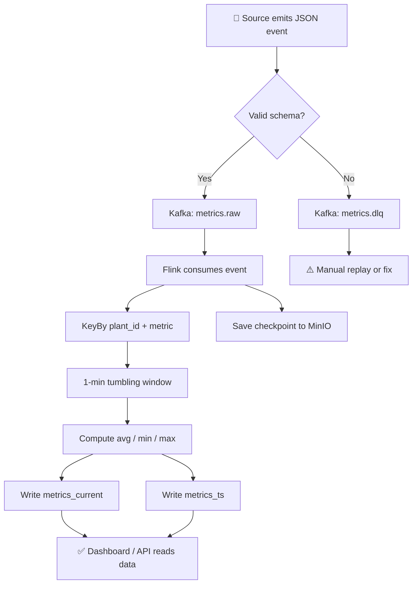
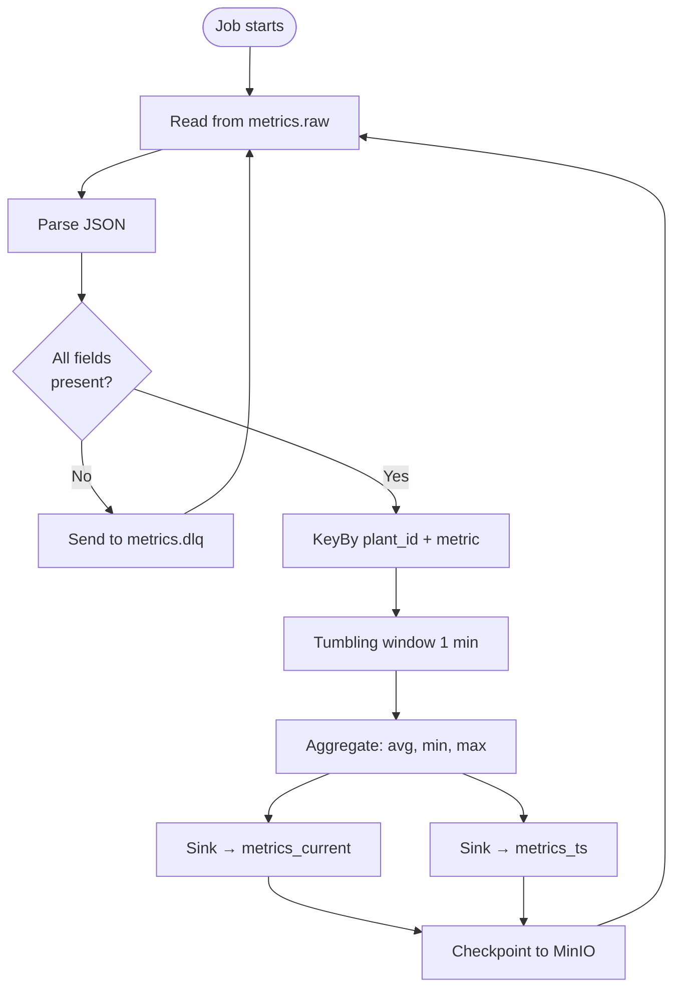
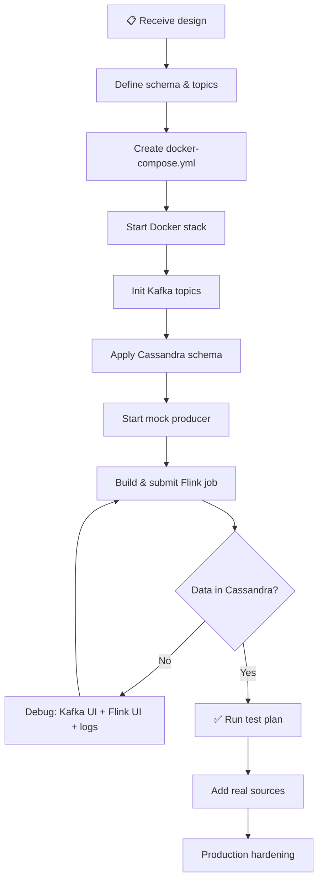
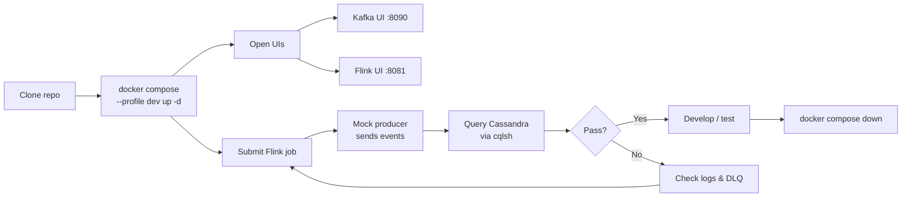
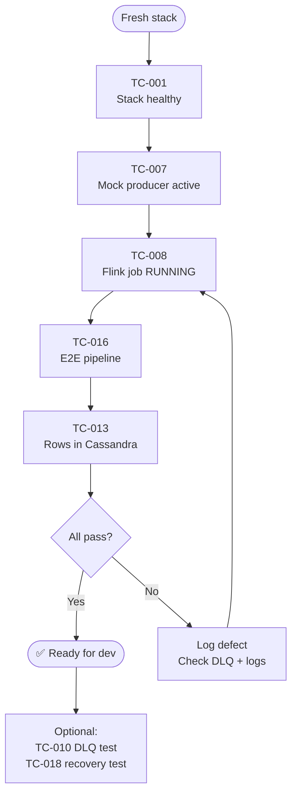
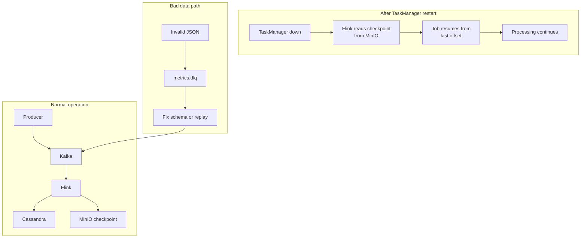
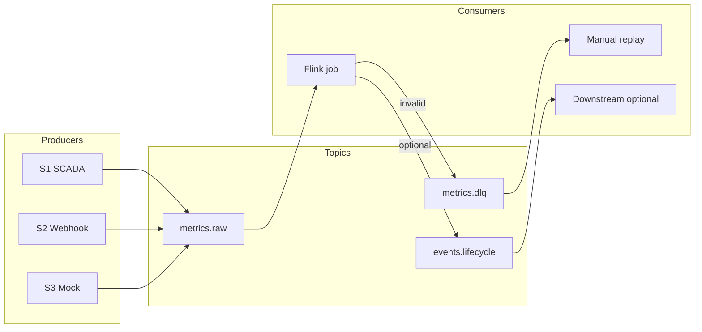

# Workflow Charts — RDG Stream Platform

> Visual guides for data flow, build steps, and local testing.  
> Index: [README.md](./README.md) · Components: [pipeline.md](./pipeline.md) · Tasks: [tasks/](./tasks/)

---

## 1. System overview

How all parts connect:



| # | Stage | What happens |
|---|-------|--------------|
| ① | Sources | Equipment sends JSON metric events |
| ② | Kafka | Events buffered in `metrics.raw` topic |
| ③ | Flink | Validate, aggregate, route |
| ④ | Cassandra | Store current values + time-series |

---

## 2. Event lifecycle (single message)

What happens to one metric event from start to finish:



**Timeline example:**

```
T+0s    Mock producer sends { plant_id: NM01, value: 45.2 }
T+1s    Message lands in Kafka metrics.raw
T+2s    Flink picks up message
T+60s   Window closes → aggregate written to Cassandra
T+61s   SELECT from metrics_current returns result
```

---

## 3. Flink processing workflow

Inside the Flink job:



---

## 4. Build workflow (design → running system)

Steps to go from architecture design to a working local stack:



| Step | Command / action | Verify |
|------|------------------|--------|
| 1 | Read [architecture.md](./architecture.md) | Schema defined |
| 2 | `docker compose --profile dev up -d` | All containers healthy |
| 3 | Init scripts run automatically | Topics + tables exist |
| 4 | Submit PyFlink job (`flink run -py`) | Job = RUNNING |
| 5 | Wait 90s | `SELECT * FROM rdg.metrics_current` |

Full checklist: [implementation-checklist.md](./implementation-checklist.md)

---

## 5. Local dev workflow

Day-to-day flow for developers:



**Quick commands:**

```bash
docker compose --profile dev up -d          # start
docker compose ps                           # health check
docker compose logs mock-producer --tail 20 # producer
docker compose exec cassandra cqlsh -e "SELECT * FROM rdg.metrics_current LIMIT 5;"
docker compose --profile dev down -v        # stop + reset
```

---

## 6. Test workflow

Smoke test sequence (minimum validation):



Full test cases: [test-plan.md](./test-plan.md)

---

## 7. Failure & recovery workflow

What happens when a service restarts:



---

## 8. Topic routing

Where messages go:



---

## Legend

| Symbol | Meaning |
|--------|---------|
| Solid arrow `-->` | Data flow |
| Dotted arrow `-.->` | Monitor / debug only |
| Diamond `{}` | Decision point |
| Cylinder `[( )]` | Database / queue |
